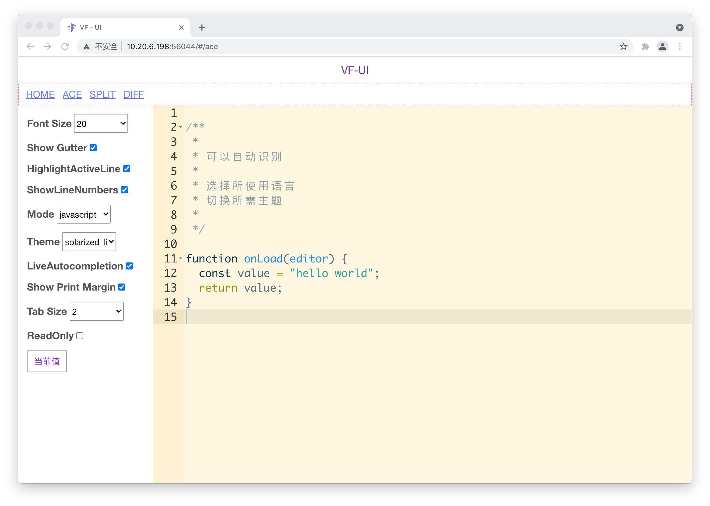
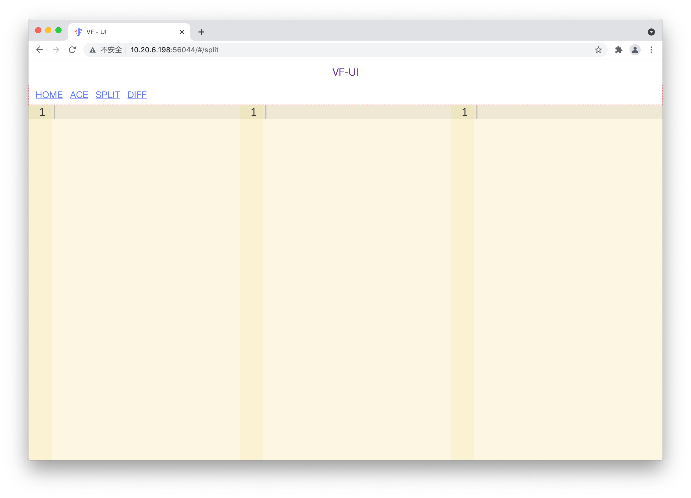
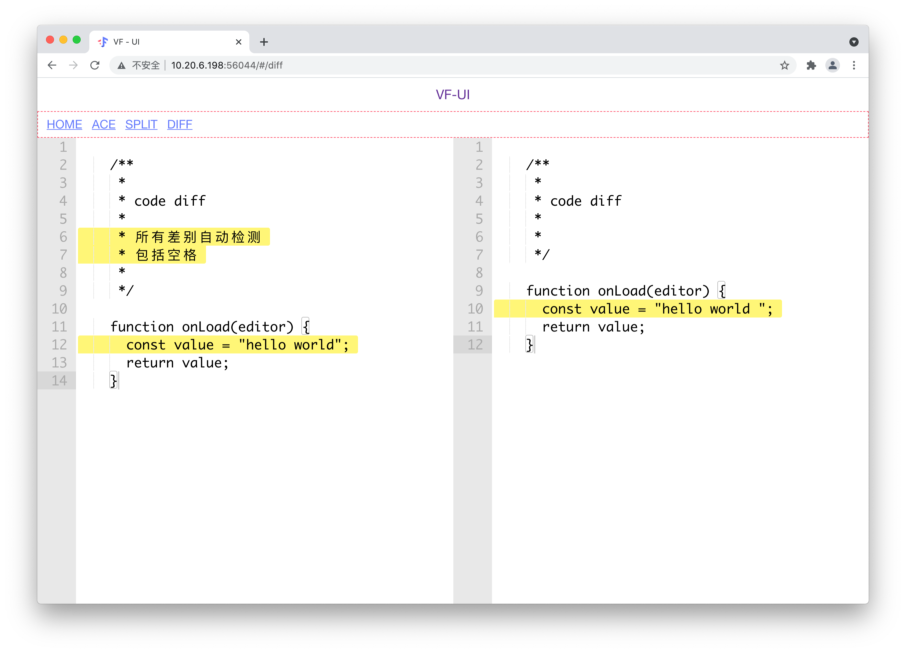

# vf-vue-ace

<p align="center">
  
</p>

<p align="center">
  Vue Ace Editor
</p>

<p align="center">
  <a href="https://www.npmjs.com/package/vf-vue-ace">
    
  </a>
  <a href="https://www.npmjs.com/package/vf-vue-ace">
    
  </a>
  <a href="https://www.npmjs.com/package/vf-vue-ace">
    
  </a>
   <a href="https://www.npmjs.com/package/vf-vue-ace">
    
  </a>
  <a href="https://www.npmjs.com/package/vf-vue-ace">
    
  </a>
</p>

## 如何使用

### install

```
npm install --save vf-vue-ace

npm install --save ace-builds
```

### usage

```js
// mian.js
// 全局安装插件
import Vue from "vue";
import VFACE from "vf-vue-ace";
Vue.use(VFACE);
```

```html
<template>
  <vf-ace
    width="100%"
    height="500px"
    placeholder="vf-ace 编辑器"
    :fontSize="20"
    :enableLiveAutocompletion="true"
    mode="mysql"
    theme="monokai"
  />
</template>
```

```js
import "ace-builds/src-min-noconflict/ext-searchbox";
import "ace-builds/src-min-noconflict/ext-language_tools";

const languages = ["mysql", "golang"];
const themes = ["monokai", "solarized_light"];

languages.forEach((lang) => {
  require(`ace-builds/src-noconflict/mode-${lang}`);
});
themes.forEach((theme) => {
  require(`ace-builds/src-noconflict/theme-${theme}`);
});
```

### vf-ace

<p align="center">
  
</p>

### vf-split

<p align="center">
  
</p>

### vf-diff

<p align="center">
  
</p>

## Project setup

```bash
npm install

// run example
npm run dev
```

## 主要功能

| 属性                     | 类型      | 描述                     | 默认值  |
| ------------------------ | --------- | ------------------------ | ------- |
| width                    | `string`  | 组件宽度，一般设置`100%` | `500px` |
| height                   | `string`  | 组件高度                 | `500px` |
| placeholder              | `string`  | placeholder              | -       |
| fontSize                 | `number`  | 编辑器字体大小           | `12`    |
| enableLiveAutocompletion | `boolean` | 编辑器自动提示           | -       |
| mode                     | `string`  | 选择编辑器语言           | -       |
| theme                    | `string`  | 选择编辑器主题           | -       |
